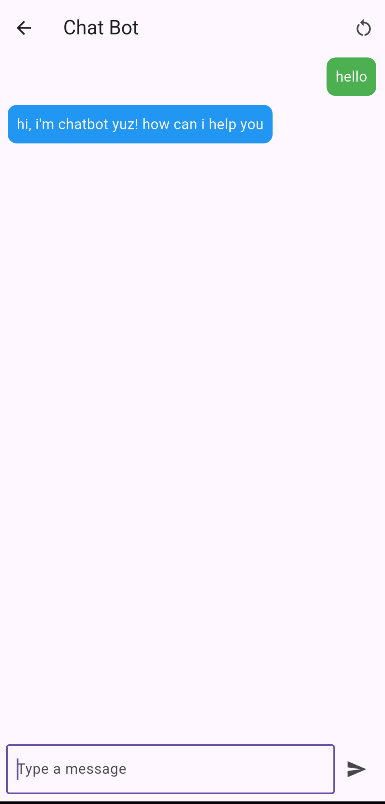

# یک برنامه ساده یوز برای اندروید

این فقط یک نمونه برنامه ساده اندرویدی برای ساخت چت بات با کتابخونه قدرتمند یوز میباشد


**اجرا**

```bash
git clone https://github.com/yooz-lang/simple-yooz-android
cd simple-yooz-android
flutter pub get
flutter run
```

### نکات قبل از اجرا: 
در مسیر lib/main.dart یه متقیر هست که باید کد هاتون رو با یوز بنویسین و بعد اجرا کنین


<br><br>

**عکس از برنامه**




<br><br><br>
# simple yooz for android

This is just an example of a simple Android application for creating a chatbot with the powerful library of Yuz

**run**
```bash
git clone https://github.com/yooz-lang/simple-yooz-android
cd simple-yooz-android
flutter pub get
flutter run
```
### Tips before implementation: 
In lib/main.dart path, there is a variable that you have to write your code with Yuz and then run it.
